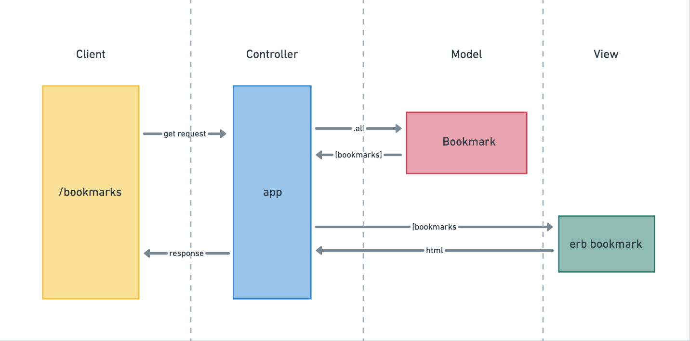

Bookmark Manager

User story 1
As a user,
So that I can quickly visit my favourite websites,
I'd like the Bookmark Manager to display a list of bookmarks on its homepage

Domain model

To set up the database from scratch, do the following:

1. Connect to psql, using the command psql postgres
2. Create the database using the psql command CREATE DATABASE bookmark_manager;
3. Connect to the database using the pqsl command \c bookmark_manager;
4. Run the query just saved in the file 01_create_bookmarks_table.sql
